<div align="center">

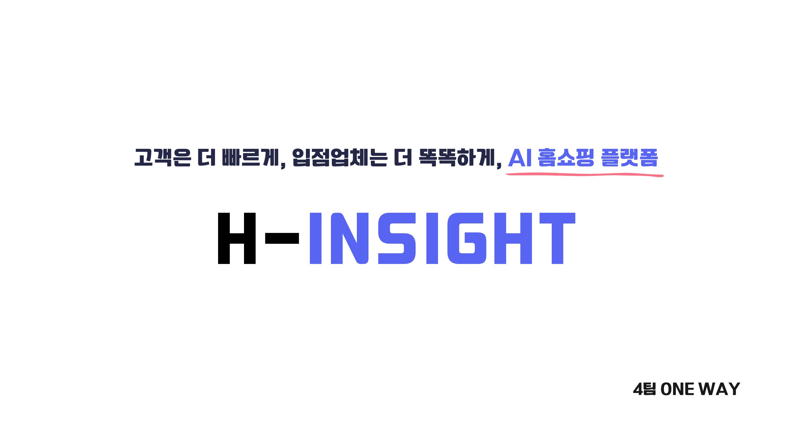

# H-Insight-AI

**고객은 더 빠르게, 입점업체는 더 똑똑하게 — AI 홈쇼핑 플랫폼**

라이브 커머스의 고객 행동·리뷰·구매 데이터를 파이프라인으로 흘려보내,
고객에게는 *빠른 탐색과 즉답*을, 입점업체에게는 *판매 인사이트와 업무 자동화*를 제공합니다.

<br/>


**4팀 ONE WAY** · 안정민 · 공채연 · 홍준표 · 안의찬

</div>

---

## 목차

1. [프로젝트 소개](#1-프로젝트-소개)
2. [핵심 기능](#2-핵심-기능)
3. [클라우드 아키텍처](#3-클라우드-아키텍처)
4. [데이터 파이프라인 (핵심)](#4-데이터-파이프라인-핵심)
5. [AI / ML](#5-ai--ml)
6. [기술적 도전과 실측](#6-기술적-도전과-실측)
7. [기술 스택](#7-기술-스택)
8. [프로젝트 구조](#8-프로젝트-구조)
9. [로컬 실행](#9-로컬-실행)
10. [팀](#10-팀)

---

## 1. 프로젝트 소개

라이브 커머스에서는 방송 중 **채팅·검색·클릭·구매**가 폭발적으로 발생하지만,
- **고객**은 원하는 상품을 빠르게 찾지 못하고, 반복되는 질문에 답을 못 받으며,
- **입점업체**는 "왜 안 팔리는지"를 데이터로 진단받지 못합니다.

**H-Insight-AI**는 이 문제를 두 방향에서 해결합니다.

| 대상 | 제공 가치 |
|------|-----------|
| 🛍 **고객** | 한국어 형태소·오타교정 검색, 리뷰 기반 AI 챗봇 즉답, 실시간 급상승 랭킹, 라이브(VOD) 커머스 |
| 🏢 **입점업체(Biz)** | 판매 KPI 대시보드, 리뷰 감성·키워드 분석, LLM 판매 전략, 병목 상품 자동 진단·개선(MCP) |

> 데모는 SPA 브랜드 **에잇세컨즈**의 상품 데이터(상품 763종 · 카테고리 21 · 속성 11필드)를 사용했습니다.

<div align="center">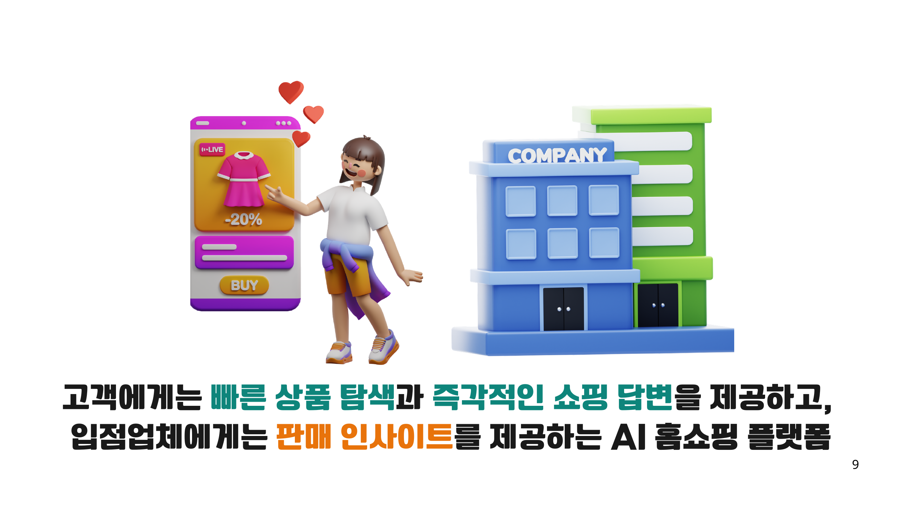</div>

---

## 2. 핵심 기능

### 🛍 고객 (Customer)

- **상품 검색** — Elasticsearch(Nori 형태소 분석 + `term suggester` 오타교정 + BM25, `productName^2` 부스팅). ES 장애 시 **DB `LIKE` 검색으로 자동 폴백**.
- **AI 채팅봇** — 리뷰·공식 스펙 기반 RAG 답변. Aho-Corasick 금칙어 필터 → 유사질문 군집화 → **시맨틱 캐시(Redis)** → Gemini 호출로 이어지는 다단계 최적화.
- **실시간 급상승 랭킹** — Kafka 이벤트를 Redis Sorted Set 분(分) 버킷에 적재, 최근 1시간을 합산해 초 단위로 노출.
- **라이브(VOD) 커머스** — 방송 화면 + 실시간 채팅 + 추천 픽.
- **가상 대기열** — 대규모 트래픽 시 CloudFront 대기 페이지로 유입을 제어(AIMD).
- 장바구니 · 주문 · 마이페이지 · 회원(고객/기업 분리 인증).

### 🏢 입점업체 (Biz)

- **비즈니스 대시보드** — 매출·주문·방문자 KPI, 일별 추이, 카테고리 점유율, 검색 랭킹. **DB를 직접 조회하지 않고 미리 만들어 둔 mart JSON만 read**.
- **상품 분석** — 상품별 리뷰 감성 비율(긍/중/부), 주요 키워드, 부정 원인, 카테고리 평균 대비 성과.
- **AI 판매 전략** — LLM이 집계 지표를 근거로 상품별 진단·개선안 생성.
- **판매 개선 자동화(MCP)** — 검색/클릭/구매 퍼널의 병목을 3단계로 진단하고, 담당자 **원클릭 승인**으로 반영(Human-in-the-loop).
- **AI 리포트** — 매일 아침 리포트를 **Notion·메일로 자동 발송**.

---

## 3. 클라우드 아키텍처

<div align="center">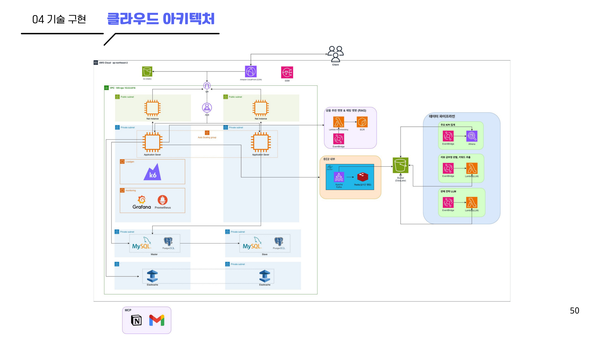</div>

- **리전** `ap-northeast-2` · VPC `10.0.0.0/16` · Public/Private 서브넷 다중 AZ
- **서빙** CloudFront(CDN) → ALB → Auto Scaling(EC2, Spring 앱) → RDS(MySQL, Master/Slave) · ElastiCache(Redis)
- **EC2 내부** Apache Kafka · Redis(실시간 랭킹) · Elasticsearch
- **AI 서빙** BGE-M3 임베딩을 **Lambda(ECR)로 분리**, EventBridge로 5분 주기 워밍
- **데이터 파이프라인** S3 데이터레이크 → EventBridge → Athena / Lambda(LLM) → mart JSON
- **관측** Prometheus + Grafana, 부하는 k6로 발생
- **업무 자동화** MCP → Notion · Gmail

---

## 4. 데이터 파이프라인 (핵심)

> **"로그를 운영 DB에 저장하지 않는다."** — 이 결정이 이 프로젝트의 척추입니다.

### 왜 DB에 안 쌓는가 — 직접 측정한 근거

전용 RDS(`db.t3.small`)에 구매이력 30만 행을 넣고, **상품별 매출 집계 쿼리를 4분간 반복**하면서 동시에 일반 사용자 조회를 측정했습니다.

<div align="center">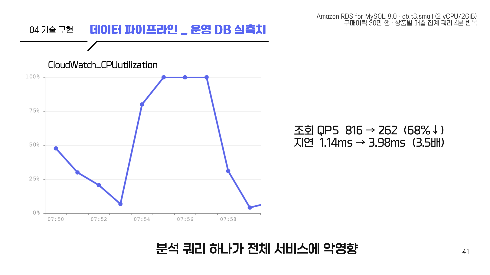</div>

| 지표 | 평상시 | 집계 중 | 변화 |
|------|--------|---------|------|
| DB CPU | 4% | **100% (4분 포화)** | — |
| 조회 QPS | 816 | 262 | **−68%** |
| 조회 지연 | 1.14ms | 3.98ms | **×3.5** |

→ **분석 쿼리 하나가 전체 서비스를 인질로 잡는다.** 그래서 분석 경로를 서비스 DB에서 분리했습니다.

### 람다 아키텍처 — 성격에 맞게 분리

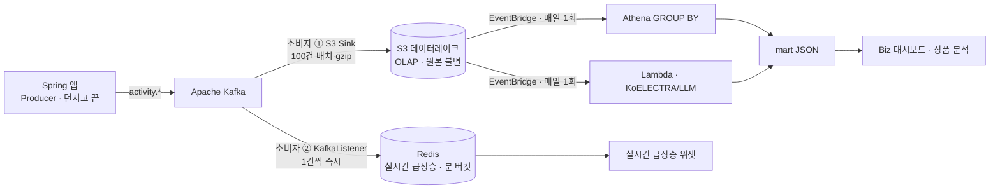

**Kafka를 쓰는 이유** — 같은 이벤트를 *배치(S3)* 와 *실시간(Redis)* 두 소비자가 각자 진도로 읽어야 하기 때문(컨슈머 그룹 팬아웃). 앱은 던지고 끝나므로 앱이 무거워지지 않습니다.

<div align="center">
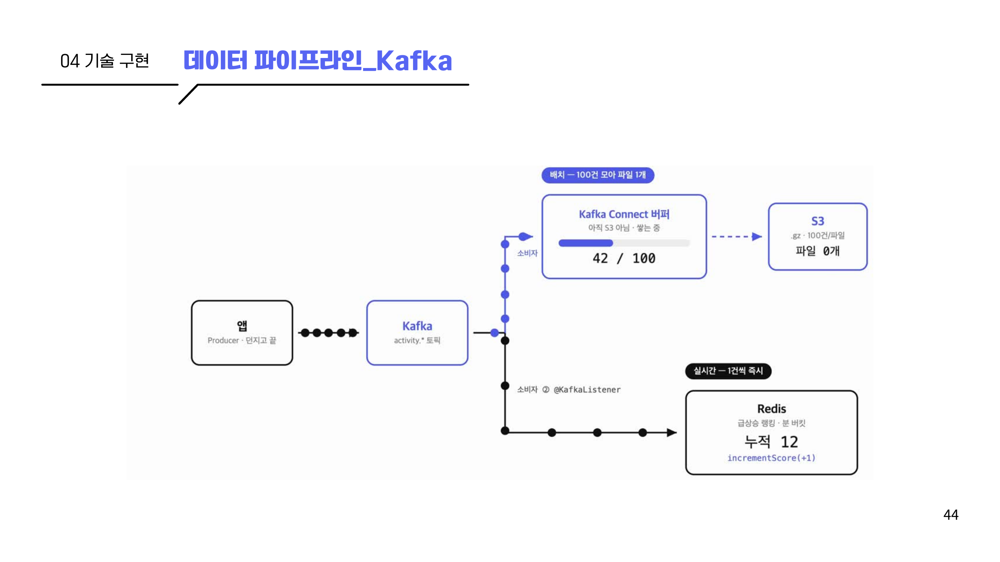
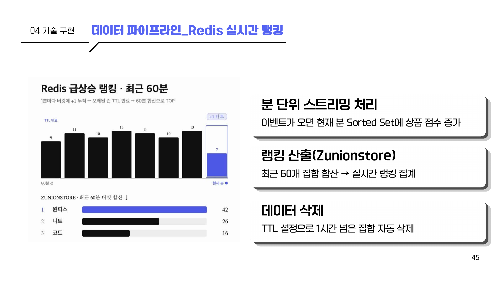
</div>

- **배치 경로** — Kafka Connect S3 Sink가 100건을 모아 `gzip` 파일 1개로 적재(요청 수 1/100). 날짜 폴더 파티셔닝으로 스캔량=비용을 최소화.
- **실시간 경로** — `@KafkaListener`가 이벤트마다 Redis Sorted Set의 현재 분 버킷 점수를 +1. 최근 60개 버킷을 `ZUNIONSTORE`로 합산해 급상승 TOP을 만들고, TTL로 오래된 버킷은 자동 소멸.
- **집계 경로** — EventBridge(매일 1회)가 Athena(KPI 집계)와 Lambda(리뷰 감성·전략)를 트리거 → **각 화면이 바로 그릴 mart JSON** 생성.

<div align="center">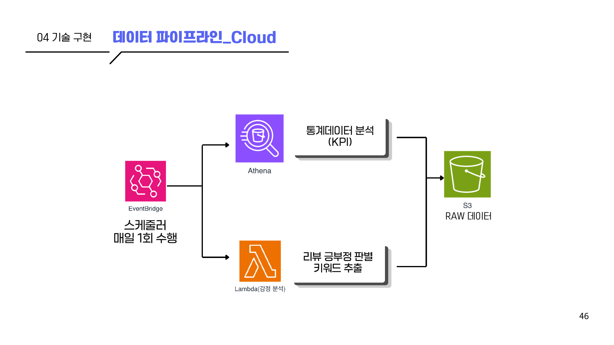</div>

---

## 5. AI / ML

<div align="center">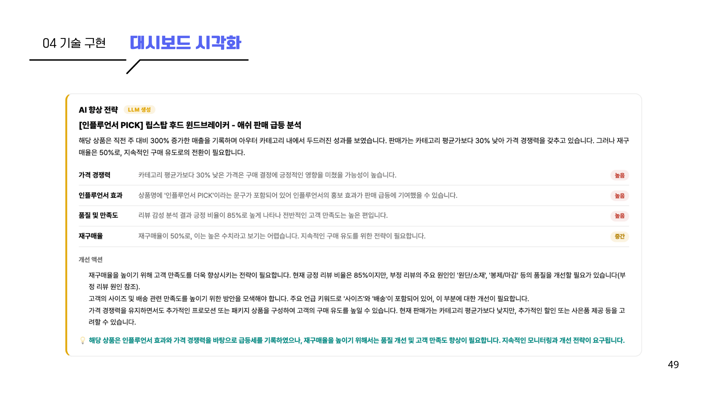</div>

### 판매 전략 LLM (`lambda/strategy_mart`)
- 입력은 **리뷰 원문이 아니라 집계 지표만** — 급등/급락 TOP 상품의 매출·성장률·가격·재구매율 + 감성%·키워드·부정 원인.
- **프롬프트 엔지니어링**: 지표 라벨 구조화, 인과 추론 유도(CoT), JSON 스키마 강제, `temperature 0.3`(사실성 > 창의성), 방어적 파싱 + 재시도.
- **폴백 체인**: NVIDIA NIM(`llama-4-maverick`) → Gemini → 템플릿.

### 리뷰 감성 분석 (`lambda/reviews_analysis`)
- 로컬 **KoELECTRA**로 긍/부정 판별 + 10개 측면(핏·사이즈·소재·색상·배송·가격·봉제마감·보풀·세탁·냄새) 키워드 매칭 → mart JSON. 컨테이너 이미지(ECR)로 배포.

### AI 채팅봇 — 토큰 최적화
<div align="center">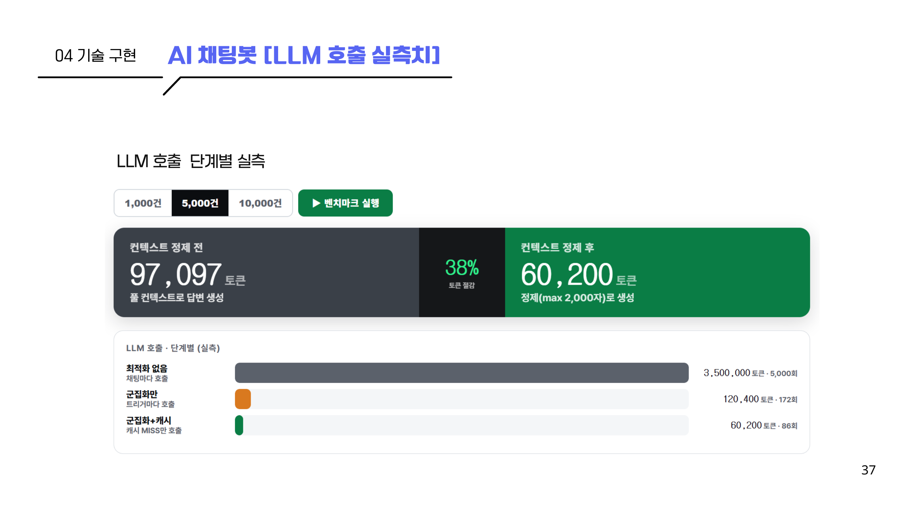</div>

- **Aho-Corasick** 금칙어 사전(수만 개를 O(N) 인메모리 스캔) → 유사질문 **군집화**(cos ≥ 0.85) → **시맨틱 캐시**(Redis, cos ≥ 0.92, TTL 30분) → 캐시 미스만 Gemini 호출.
- 실측: 컨텍스트 정제(max 2,000자)로 **97,097 → 60,200 토큰(38%↓)**, 채팅 20건 → 실제 LLM 호출 3건(**85%↓**).

### 임베딩 서빙 (`lambda/embedding`)
- **BGE-M3 → ONNX** 변환 후 Lambda로 분리(`onnxruntime`). EC2 상주 메모리 1.2GB 회수, 콜드스타트 27s → **~0.25s**(5분 주기 워밍), Ollama 대비 레이턴시 **43%↓**.
- 벡터 검색은 **pgvector**(PostgreSQL) 기반 RAG.

### 상품 검색 (Elasticsearch)
<div align="center">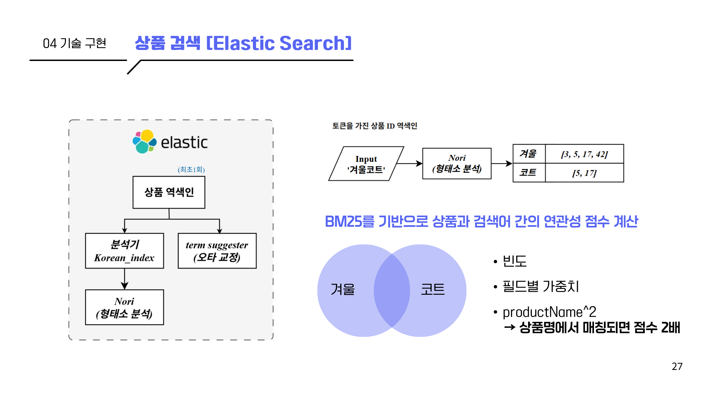</div>

### 판매 개선 자동화 (MCP)
<div align="center">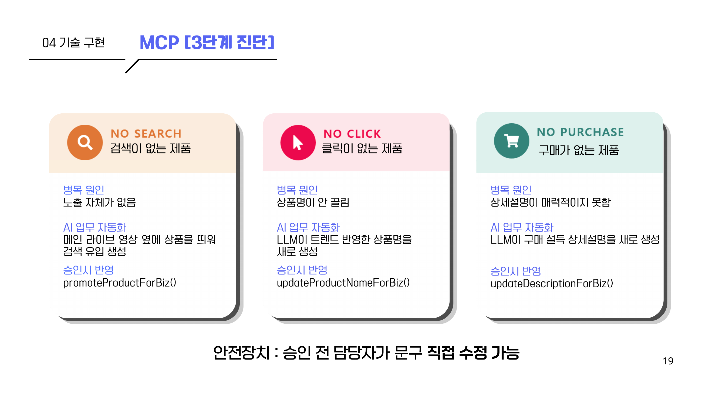</div>

---

## 6. 기술적 도전과 실측

| 주제 | 문제 | 해결 | 결과 |
|------|------|------|------|
| **정적 리소스 CDN 이관** | 앱 서버가 이미지 서빙에 CPU/메모리 낭비, 로딩 지연 | 정적 자산을 CloudFront로 이관 | TTFB **~48%↓** |
| **Spring `resource-chain` 장애** | `chain=on` + 상대경로가 S3 자산을 "내부 리소스"로 오인해 무한 탐색 → CPU DOWN | 절대경로화 + `chain` 조정 | 성공률 27.3% → **94.1%** |
| **가상 대기열** | 스파이크 트래픽에 Hikari 풀(20) 병목 → 연쇄 타임아웃 | CloudFront 대기 페이지 + ElastiCache 유입 제어(AIMD) | 무방비 에러 노출 차단 |
| **부하 관측** | 개선 전/후 비교 근거 필요 | k6 3,000명 스파이크 + Prometheus/Grafana | RPS·지연·풀 실시간 관측 |

<div align="center">
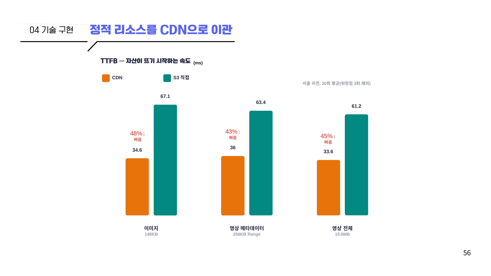
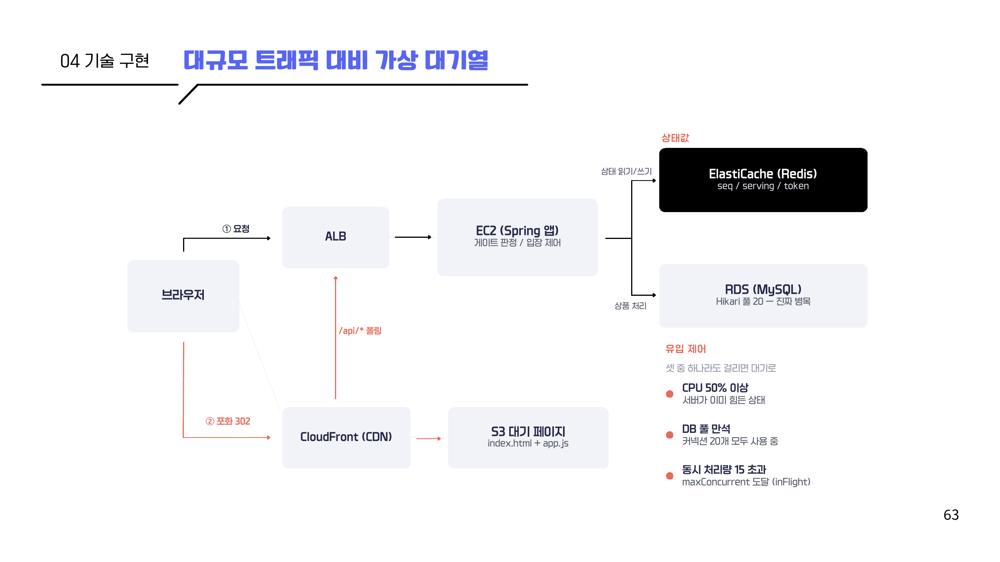
</div>

---

## 7. 기술 스택

| 구분 | 사용 기술 |
|------|-----------|
| **Backend** | Java 17, Spring Boot 3.5.0, Spring Security, Spring WebSocket, MyBatis 3.0 |
| **Datastore** | MySQL(OLTP), PostgreSQL + pgvector(벡터), Redis(캐시·랭킹·대기열), Elasticsearch 8.18(Nori) |
| **Messaging** | Apache Kafka, Kafka Connect(S3 Sink) |
| **AI / ML** | Spring AI(Gemini), NVIDIA NIM, KoELECTRA, BGE-M3(ONNX), Aho-Corasick |
| **Cloud (AWS)** | S3, MSK/MSK Connect, Athena + Glue, Lambda, EventBridge, CloudFront, EC2, RDS, ElastiCache, SSM |
| **Observability** | Prometheus, Grafana, Micrometer/Actuator, k6 |
| **Frontend** | Thymeleaf, Thymeleaf Layout Dialect |
| **협업** | Jira · GitHub · Discord · Notion · Figma · Draw.io |

---

## 8. 프로젝트 구조

```
H-Insight-AI/
├── src/main/java/com/hinsight/
│   ├── product/            # 상품 · Elasticsearch 검색(es/)
│   ├── chatbot/            # 라이브 질문봇(질문 파싱·추천)
│   ├── cart/ order/ review/ recommendation/
│   ├── live/               # 라이브(VOD) 커머스 + 채팅
│   ├── hottrend/           # 실시간 급상승 랭킹(Redis)
│   ├── behaviorlog/        # 행동 로그(Kafka Producer)
│   ├── waitingroom/        # 가상 대기열(AIMD 유입 제어)
│   ├── biz/                # 입점업체: auth · dashboard · report · reviewanalysis
│   ├── ai/
│   │   ├── rag/            # RAG(질문봇·군집화·시맨틱 캐시·QuestionGuard)
│   │   ├── vectorstore/    # pgvector 검색
│   │   ├── embedding/      # BGE-M3 임베딩(Lambda invoke)
│   │   ├── analysis/       # 리뷰 감성
│   │   ├── report/         # 리포트 생성
│   │   └── mcp/notion/     # MCP · Notion 연동
│   ├── auth/ user/ home/ common/ config/ security/ exception/
│   └── HInsightAiApplication.java
├── lambda/                 # 데이터 파이프라인 (Python)
│   ├── aggregate_mart_athena/   # Athena KPI 집계 → mart JSON
│   ├── reviews_analysis/        # KoELECTRA 감성·키워드 (컨테이너)
│   ├── strategy_mart/           # NVIDIA→Gemini 판매 전략
│   └── embedding/               # BGE-M3 ONNX 임베딩 서빙
├── docs/
│   ├── cloud/              # S3·MSK·Connect·Athena·Lambda·EC2 배포 가이드(01~09)
│   ├── aggregation/        # 마트 생성 스크립트·검증 SQL
│   └── images/             # README·발표 슬라이드
├── monitoring/             # Prometheus + Grafana 스택
├── waiting-room/           # 대기열 정적 페이지(S3/CloudFront)
├── sql/                    # 마이그레이션 SQL
├── docker-compose.yml      # kafka·connect·es·redis·minio·exporters
└── build.gradle
```

---

## 9. 로컬 실행

### 사전 요구
- JDK 17, Docker / Docker Compose
- `.env` (DB·Redis·Kafka·AI 키 등. 커밋 금지 — `.gitignore` 처리됨)

### 1) 인프라 기동
```bash
# Kafka + Connect + Elasticsearch + Redis + MinIO(S3 대체)
docker compose --profile local up -d
```

### 2) 애플리케이션 실행
```bash
./gradlew bootRun
# 기본 프로필 dev · http://localhost:8080
```

### 3) 모니터링(선택)
```bash
docker compose -f monitoring/docker-compose.yml up -d
# Prometheus :9090 · Grafana :3000
```
> 부하테스트 baseline 모니터링 구성은 [monitoring/README.md](monitoring/README.md) 참고.

### 데이터 파이프라인(클라우드)
S3 데이터레이크 → MSK/Connect → Athena/Lambda 배포는 [docs/cloud/](docs/cloud/) 의 단계별 가이드(01~09)를 참고하세요.

---

## 10. 팀

**4팀 ONE WAY** — *"화려함보다 견고함"*

| 이름 | GitHub |
|------|--------|
| 안정민 | [@Dev-Anniee](https://github.com/Dev-Anniee) |
| 공채연 | [@chaeyeonKong](https://github.com/chaeyeonKong) |
| 홍준표 | [@HongJunPyo0222](https://github.com/HongJunPyo0222) |
| 안의찬 | [@Ui-chan](https://github.com/Ui-chan) |

<div align="center">
<br/>
<sub>© 2026 H-Insight-AI · 4팀 ONE WAY</sub>
</div>
